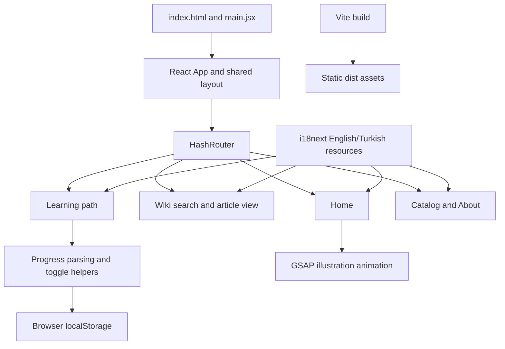

# NeuroFly — Robotics Learning Portal

[](https://github.com/dilarakoru/neurofly-web/actions/workflows/ci.yml)

A bilingual React frontend for educational robotics: explore the platform, search learning resources and track progress through introductory modules.

**Published NeuroFly website: [www.neurofly.net](https://www.neurofly.net/)** · [Live wiki](https://www.neurofly.net/wiki.html) · [Developer resources](https://www.neurofly.net/software.html)


**Contents:** [Live site/repository](#live-site-and-this-repository) · [Architecture](#architecture) · [Content/data](#content-and-data-model) · [Run](#local-development) · [Build/deploy](#production-build-and-hosting) · [Validation](#validation)

## Live site and this repository

NeuroFly has a published website at **neurofly.net** introducing its educational drone platform and linking to documentation and software resources. This repository contains a **React learning-portal iteration prepared from the existing local frontend project**.

The site and repository are related, but they are not verified as the same deployment. The public site exposes `.html` pages; this build uses hash routes and includes a local learning checklist. No source identity, backend integration or hardware behavior is inferred from the domain alone. The screenshot above is the React repository version.

| Area | Published website observed | This repository |
|---|---|---|
| Home | Educational platform presentation | Learning entry point with local illustration |
| Wiki | `wiki.html` | `/#/wiki`, article/category selection and search |
| Software | `software.html`, developer/download resources | `/#/software`, three-module checklist |
| Market | `market.html`, store page | `/#/market`, educational module catalog |
| About | Live site's own content | `/#/contact`, scope of this iteration |
| Deployment | Public domain is live | No automatic deployment to that domain configured |

The live link provides project context. This frontend does not itself run an AI model, control flight hardware, process payments or distribute firmware. Connecting those capabilities requires additional implementation and validation.

## User journeys

1. Discover the learning portal and navigate to modules or guides.
2. Filter wiki titles/content, choose a category and open an article.
3. Complete introductory modules and inspect progress.
4. Reload and resume from valid progress saved in the same browser.
5. Switch between English and Turkish.

This iteration replaces placeholder store/download actions in the local prototype with a coherent learning flow. It demonstrates frontend product engineering, alongside the separate AI-focused projects in the portfolio.

## Architecture



There is no application backend, database, account service or inference API. React manages interface state, React Router maps routes, i18next resolves translations and localStorage persists progress. Vite produces static assets.

### Stack and choices

| Technology / method | Responsibility | Reason and trade-off |
|---|---|---|
| React 19 | Components and local state | Small product surface without a global state framework |
| React Router 7, HashRouter | Five routes | Static hosting without deep-link rewrites; URLs contain `#` |
| i18next / react-i18next | English/Turkish resources | Shared content keys; some concise labels are colocated in pages |
| Vite 7 | Development and build | Standard workflow, relative asset base |
| GSAP | Decorative animation | Effect cleanup and reduced-motion preference handling |
| localStorage | Progress | No login requirement; no cross-device synchronization |
| Node test runner / ESLint | Logic checks and lint | Fast validation without a backend service |

Exact resolved versions are in `package-lock.json`; `npm ci` reproduces them. The animation uses a local SVG, respects the initial reduced-motion preference and reverts its GSAP context when unmounted.

## Content and data model

This project uses **static educational content**, not a machine-learning dataset. Inherited article text and translations live in `src/i18n.js`; catalog content and some labels live in page components. No CMS, external content ingestion or runtime content API is implemented.

### Wiki

Five article IDs are grouped under three stable internal categories:

| Category key | Article IDs |
|---|---|
| Getting Started | `getting-started-1` |
| PC Control | `cfclient-intro`, `cfclient-python`, `cfclient-verify` |
| Python Control | `python-intro` |

The selected language resolves titles and content. Search lowercases the query and checks substring inclusion in title/content strings. It is client-side filtering, not semantic retrieval, embeddings or RAG. Selecting an article clears the query. Article and category selection are local component state.

Article HTML is trusted, bundled project content. Replacing it with untrusted user/CMS HTML would require a sanitization design. Hardware-specific reference material needs domain review; compatibility and flight behavior were not tested in this frontend work.

### Learning progress

Storage key: `neurofly-progress`. Example:

```json
["platform", "connection"]
```

Allowed IDs are `platform`, `connection`, and `python`. `parseProgress` accepts arrays only, removes duplicates and unknown IDs, and returns an empty list for malformed JSON. `toggleLesson` adds/removes a known ID without mutating the previous array. Storage read/write errors are caught so the interface can continue with session state.

Progress is derived from valid completed IDs, with a maximum of three. It is browser-specific; clearing storage resets it. It is not synced to an account or sent to an application backend. Language switching works, but language preference persistence after reload is not claimed.

## Local development

Requirements: **Node.js 22.12+**, npm and Git. CI uses Node 24; initial local verification used Node 24.13.1. Python is only needed for the optional Windows fallback.

```bash
git clone https://github.com/dilarakoru/neurofly-web.git
cd neurofly-web
npm ci
npm run dev
```

Open the URL printed by Vite, normally **http://localhost:5173**. No API key, `.env`, database or model download is needed.

| Route | View |
|---|---|
| `/#/` | Home |
| `/#/wiki` | Documentation |
| `/#/software` | Learning checklist |
| `/#/market` | Module catalog |
| `/#/contact` | About / project scope |

`Software`, `Market` and `Contact` filenames preserve the earlier structure; their current behavior is described above.

## Production build and hosting

```bash
npm run lint
npm test
npm run build
npm run preview
```

Vite writes **`dist/`**. The preview URL is normally **http://localhost:4173**. Publish the contents of `dist/`, not the source tree or `node_modules`. `base: './'` preserves relative asset paths; hash routing avoids server-side deep-link rewrite requirements.

The standard production build passed on GitHub Actions. This repository does **not automatically update neurofly.net**. Replacing the published site would require its actual hosting configuration and a deliberate release; no live-site replacement was performed during portfolio preparation.

### Optional Windows build fallback

The local preparation environment blocked Node child-process creation with `spawn EPERM`. The fallback calls installed esbuild through Python:

```powershell
npm ci
npm run build:portable
python -m http.server 8003 --bind 127.0.0.1 --directory dist
```

Requirements: **Windows x64 and Python 3**. It bundles the same React source and copies public assets. It is an alternative for a constrained environment, not the default CI build. Its output was inspected in a browser.

## Validation

| Check | Evidence and scope |
|---|---|
| Reproducible dependency install | `npm ci` passed on GitHub Actions |
| Lint | ESLint passed |
| Progress parsing test | Corrupt/non-array values, duplicates and unknown IDs handled |
| Progress toggle test | Immutable updates and unknown-ID handling |
| Standard production build | Vite passed on GitHub Actions with Node 24 |
| Local browser flow | Language switching, wiki filtering, completion and reload persistence checked |
| Portable build | Local production bundle built and rendered |

These are functional checks, not a usability study or performance benchmark. There is no Lighthouse score, WCAG certification, complete device/browser matrix, screen-reader audit or hardware integration claim.

### Manual walkthrough

1. Start the application and switch English/Turkish.
2. Search the wiki for `python` and open a matching article.
3. Complete a learning module.
4. Reload and confirm its checked state remains in the same browser.
5. Toggle it off and inspect the counter.
6. Check narrow-screen and keyboard flows as additional manual work; comprehensive coverage remains future work.

## Repository structure

```text
src/main.jsx            React bootstrap and translations
src/App.jsx             Shared layout and hash routes
src/components/         Navbar, footer and GSAP illustration
src/pages/              Home, wiki, checklist, catalog, About
src/lib/checklist.js    Progress parsing and toggling
src/i18n.js             Bilingual reference content
public/drone.svg        Local illustration
scripts/                Windows build fallback
tests/                  Progress-state tests
.github/workflows/      Install, lint, test and build CI
```

## Troubleshooting

| Issue | Resolution |
|---|---|
| Unsupported engine / install error | Use Node >=22.12, preferably Node 24 to match CI, then `npm ci` |
| Restricted Windows `spawn EPERM` | Use the documented fallback; standard build is verified in CI |
| Progress not saved | Check storage restrictions/clearing; progress is device-local |
| Static-host blank page | Publish `dist/` contents, preserve asset paths and use hash routes |
| Appearance differs from neurofly.net | This is a separate React iteration, not a verified mirror of the deployed site |

## Next steps

Add browser end-to-end tests; audit keyboard, screen-reader and mobile behavior; review educational content; define a deployment/migration plan if this iteration should replace the live site. Introduce a CMS or account synchronization only when editor/learner requirements justify it.

[Engineering decisions and demo](docs/ENGINEERING.md) · [Provenance and AI assistance](docs/PROVENANCE.md). Refactoring, tests and documentation were AI-assisted; historical contribution and hardware ownership are not inferred from the codebase.
