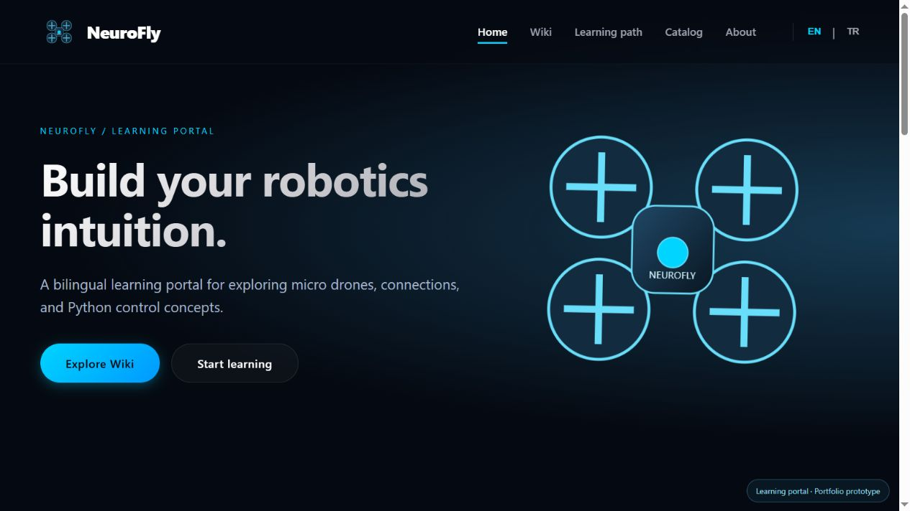

# NeuroFly Learning Portal

> Product walkthrough, design trade-offs and next experiments: [Engineering notes](docs/ENGINEERING.md).



A bilingual React product prototype for educational robotics: searchable documentation, persistent learning progress, a module catalog and responsive navigation.

This repository demonstrates frontend product engineering. **It does not currently run an AI model or control drone hardware.** It complements the two AI-focused projects in this portfolio.

## Run

Use Node.js 22.12+ (validated locally with Node 24.13.1):

```powershell
npm ci
npm run dev
```

## Build and test

```powershell
npm run lint
npm test
npm run build
npm run preview
```

The regular build uses Vite. This preparation environment denied Node child-process creation (`spawn EPERM`), so the verified local production bundle was built using the installed esbuild binary directly:

```powershell
npm run build:portable
python -m http.server 8003 --bind 127.0.0.1 --directory dist
```

The fallback requires Python 3 and Windows x64. It produces a normal static `dist/` site using the same React source. `npm run build` is included in CI but was not successfully run in this constrained environment. ESLint and both Node tests passed; the generated bundle was checked in a browser.

## Features

- English/Turkish content and language switching.
- Searchable wiki with article/category navigation.
- Three-module learning checklist; progress persists in localStorage and corrupt entries are filtered.
- Keyboard-accessible mobile navigation and focus styles.
- Hash routing and relative asset paths for static subdirectory hosting.
- Local SVG illustration; no external image/font CDN required for core rendering.
- Reduced-motion support for the drone animation.

## Scope and corrections

The existing prototype contained missing images, generic store links, placeholder firmware downloads and template README text. This version replaces those dead ends with a learning catalog and progress workflow, removes unverified store/contact actions, supplies local artwork and describes its actual capabilities.

Wiki content is inherited educational reference material; hardware compatibility and flight instructions were not tested. The project is a portal prototype, not a firmware distribution or functioning shop.

## Structure

```text
src/components/    navigation, footer, animation
src/pages/         home, wiki, learning path, catalog, about
src/lib/           validated progress state helpers
src/i18n.js        bilingual content
public/drone.svg   local artwork
scripts/           Windows portable build fallback
tests/             progress persistence logic
```

## Deployment

Upload the **contents** of `dist/` to a static host. Hash routing avoids deep-link server rewrites. The source ZIP excludes `node_modules/` and generated `dist/`; the desktop package includes a tested `dist/` for local preview. Do not upload the whole working folder as a source repository.

## AI and authorship

Portfolio refactoring, tests and documentation were AI-assisted. Historical personal contribution should be described by the author; no claim about original authorship is inferred here. See [provenance](docs/PROVENANCE.md).
